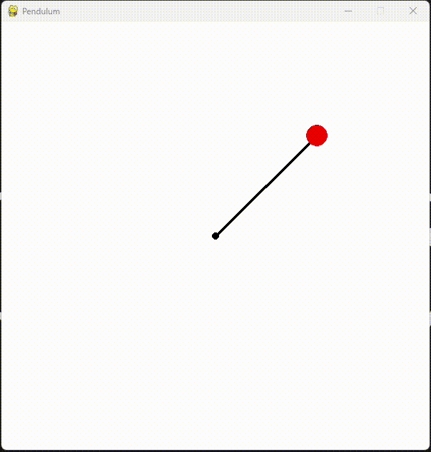
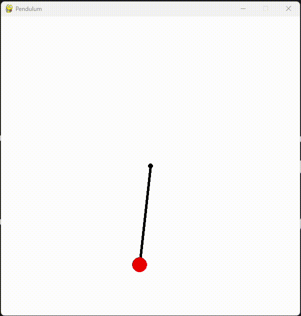

# 🧠 Reinforcement Learning Algorithms
A comprehensive collection of reinforcement learning algorithms — classic methods with linear function approximation and tabular Q-learning, as well as deep reinforcement learning approaches like DQN, DDQN, and Weighted Advantage Networks. Each algorithm is tested on environments.

---

## 🍎 Classic methods

### Cooming soon

---
## 🍏 Deep methods

### **Deep Reinforcement Learning (DRL)** 
  - where an agent learns a policy using a neural network that is trained to maximize cumulative rewards through interaction with the environment.
  - Test environment: **Pendulum**
  - ⭐ Training process:

### **Weight Agnostic Neural Networks (WAN)** 
  - a method that uses fixed network architectures and weights, relying on the structure of the network and activation functions rather than extensive training.
  - Test environment: **Pendulum**
  - ⭐ Training process:

---

## 👨‍💻 Author

**Paweł Marchel**  
If you find this project helpful, feel free to star ⭐ the repo or get in touch for collaboration.
