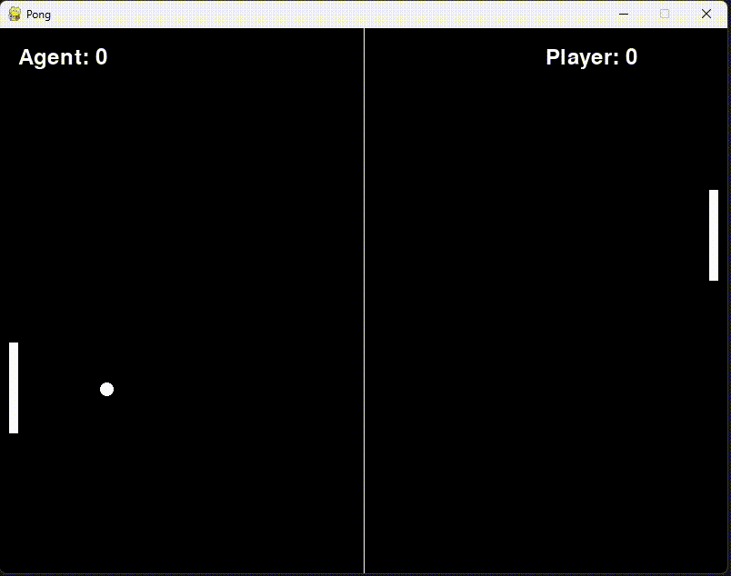
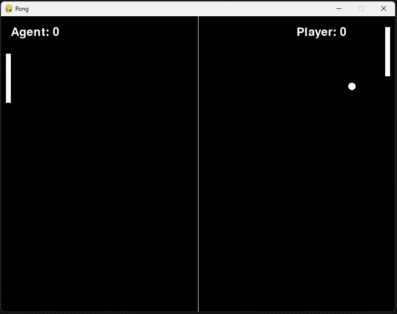

# 🧠 Reinforcement Learning Algorithms
A comprehensive collection of reinforcement learning algorithms — classic methods with linear function approximation and tabular Q-learning, as well as deep reinforcement learning approaches like DQN, DDQN, and Weighted Advantage Networks.

---

## 🍎 Classic methods

### 1. Q-Learning
- Classic RL method using a Q-table to store values for each state-action pair. Effective for small discrete state spaces but does not scale well.
- Training environment: **Pong**
- ⭐ Playing against the agent
- 

### 2. Linear Approximation
- Uses a linear model to approximate Q-values from state features, enabling learning in larger or continuous state spaces with better generalization.
- Training environment: **Pong**
- ⭐ Playing against the agent
- 

---

## 🍏 Deep methods

### **1. Deep Reinforcement Learning (DRL)** 
  - Where an agent learns a policy using a neural network that is trained to maximize cumulative rewards through interaction with the environment.
  - Training environment: **Pendulum**
  - ⭐ Training process:
  - 

### **2. Weight Agnostic Neural Networks (WAN)** 
  - A method that uses fixed network architectures and weights, relying on the structure of the network and activation functions rather than extensive training.
  - Training environment: **Pendulum**
  - ⭐ Training process:
  - 
---

## 👨‍💻 Author

**Paweł Marchel**  
If you find this project helpful, feel free to star ⭐ the repo or get in touch for collaboration.
